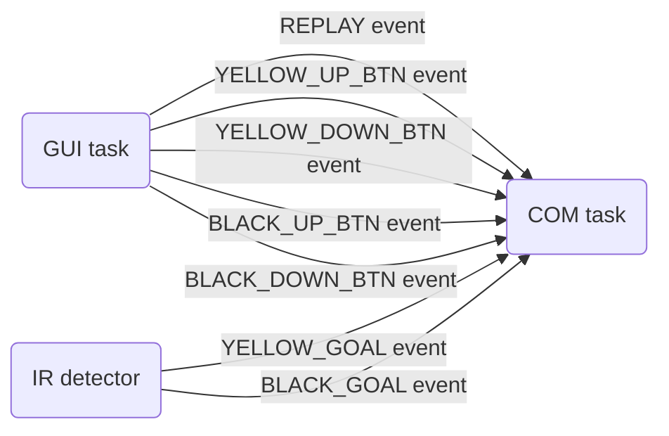

# STM32 - Software Design Description

## General overview

```mermaid
flowchart LR
    A(GUI task);
    B(COM task);
    C(IR detector);
    A -->|REPLAY event| B;
    A -->|YELLOW_UP_BTN event| B;
    A -->|YELLOW_DOWN_BTN event| B;
    A -->|BLACK_UP_BTN event| B;
    A -->|BLACK_DOWN_BTN event| B;
    C -->|YELLOW_GOAL event| B;
    C -->|BLACK_GOAL event| B;
```

## GUI task

## COM task

## IR detector

